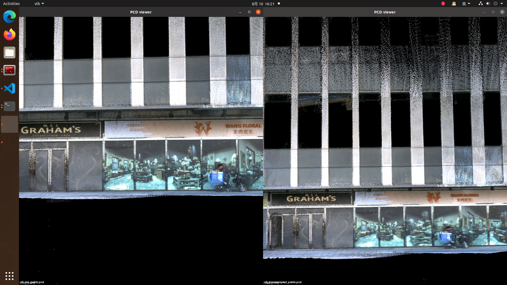

- [LIVO2流程解析](#livo2流程解析)
  - [LIVMapper 初始化](#livmapper-初始化)
  - [LIVMapper 最外层接口执行](#livmapper-最外层接口执行)
  - [点云预处理](#点云预处理)
  - [imu 单次状态更新](#imu-单次状态更新)
  - [imu 初始化](#imu-初始化)
  - [imu 误差状态矩阵计算与点云去畸变](#imu-误差状态矩阵计算与点云去畸变)
  - [重力方向对齐](#重力方向对齐)
  - [使用LIO结果直接进行RGB染色](#使用lio结果直接进行rgb染色)

# LIVO2流程解析

LIVO2 主流程

## LIVMapper 初始化

1. 从 ROS 参数服务器中读取一系列配置参数
2. LIVMapper::initializeComponents() 初始化 `vio_manager`
   1. 设置系统外参 `VIOManagerPtr vio_manager->setImuToLidarExtrinsic(extT, extR); // imu to lidar` `vio_manager->setLidarToCameraExtrinsic(cameraextrinR, cameraextrinT); // lidar to camera`
   2. `VIOManager::initializeVIO()`: 实例化 `visual_submap`, 加载针孔相机内参，图像尺寸，计算camera到imu的外参
      1. 计算`Jdphi_dR`se3对旋转矩阵的偏导, `Jdp_dR` se3 平移向量对旋转矩阵的偏导(右扰动)
      2. 图像网格属性初始化，每行/列有多少grid
      3. `raycast_en` 对于图像中的每一个网格，在其中心像素处沿视线方向（即相机光轴方向）生成一系列深度采样点 `rays_with_sample_points`
   3. `ImuProcessPtr p_imu` 初始化 p_imu

## LIVMapper 最外层接口执行

1. LIVMapper mapper.initializeSubscribersAndPublishers()
   1. lidar 点云回调
      1. [点云预处理](#点云预处理) `PreprocessPtr p_pre->process(msg, ptr);`, save to `lid_raw_data_buffer`(TODO:没有调用`Preprocess::give_feature`吗?)
   2. imu 回调
      1. 检查imu与lidar时间对齐,ros_driver_fix_en 强制硬同步，保存在 `imu_buffer`, `prop_imu_buffer`
   3. image 回调，缓存至 `img_buffer`
   4. 定时器 imu_prop_callback 0.04秒触发一次：
      1. 等待imu初始化，完成一次imu前向传播(imu积分) `prop_imu_once(imu_propagate, dt, acc_imu, omg_imu)` 
      2. 若state_update_flg（该标志在handleVIO handleLIO 中使能），基于prop_imu_buffer 数据，进行[imu前向传播](#imu-单次状态更新) `prop_imu_once(imu_propagate, dt, acc_imu, omg_imu)`，否则只对newest_imu进行传播，更新imu
      3. 提取更新后的imu_propagate发布到 `/LIVO2/imu_propagate`
2. LIVMapper::run() 
   1. `sync_packages()`，组装数据到`LidarMeasureGroup &meas`->`LidarMeasures`
      1. ONLY_LIO：同步lidar点云与imu数据, 组装数据`MeasureGroup m` 到 `LidarMeasureGroup &meas`,meas.lio_vio_flg = LIO; 
      2. LIVO,该模式下，LIO比VIO优先,它们按顺序更新，**先执行LIO再执行VIO**，LIO构建体素点云地图与几何结构，VIO进行着色与补点
         1. VIO，组装lidar点云与imu数据（选择前后两帧lidar之间的imu），后`meas.lio_vio_flg = LIO;`，进入LIO分支
         2. LIO，组装图像帧数据,记录图像帧时间与上一次lio时间(`m.vio_time` `m.lio_time`)，后`meas.lio_vio_flg = VIO;`，进入VIO分支
      3. ONLY_LO，仅使用lidar数据

lidar imu image 数据存储结构

```cpp
// LiDAR 扫描帧+imu+image数据结构
struct LidarMeasureGroup
{
  double lidar_frame_beg_time; // 帧开始时间
  double lidar_frame_end_time; // 帧结束时间
  double last_lio_update_time; // 上一次 LIO 更新的时间戳
  PointCloudXYZI::Ptr lidar; // 原始 LiDAR 点云数据
  PointCloudXYZI::Ptr pcl_proc_cur; // 当前处理后的点云
  PointCloudXYZI::Ptr pcl_proc_next; // 下一帧点云缓存
  deque<struct MeasureGroup> measures; // 包含该 LiDAR 帧期间的所有 IMU 和图像数据组
  EKF_STATE lio_vio_flg; //模式标志
  int lidar_scan_index_now; // 当前 LiDAR 扫描帧索引

   struct MeasureGroup
   {
     double vio_time; // 图像时间戳（VIO模式）
     double lio_time; // LiDAR 时间戳（LIO 模式）
     deque<sensor_msgs::Imu::ConstPtr> imu;
     cv::Mat img;

```

   1. `LIVMapper::handleFirstFrame()` 首帧数据标志
   2. `LIVMapper::processImu()` 对imu做ESKF真值状态量预测,对lidar点云做运动畸变矫正以及重力方向对齐
      1. `ImuProcess p_imu->Process2(LidarMeasures, _state, feats_undistort);` 计算imu误差状态系数矩阵更新 _state，并进行lidar点云去畸变
         1. `Forward_without_imu(lidar_meas, stat, *cur_pcl_un_);` 参考FAST-LIO 中的误差状态jacobian进行推导，如果没有imu数据则只对位姿与速度进行更新
         2. `ImuProcess::IMU_init` [imu静止初始化](#imu-初始化)
         3. `void ImuProcess::UndistortPcl` 参考FAST-LIO imu 误差状态转移方程 (ESKF)前向传播imu data(前向状态量预测积分),然后对lidar点云进行去畸变（后向传播）
      2. `gravityAlignment()` [重力方向对齐](#重力方向对齐)，原配置文件默认不执行，在imu初始化完成后执行一次
      3. 将前向传播，后向传播的结果（状态向量与去畸变点云）保存到 `voxelmap_manager->state_ = _state;voxelmap_manager->feats_undistort_ = feats_undistort;`
   3. `LIVMapper::stateEstimationAndMapping() ` 基于`LidarMeasures.lio_vio_flg`执行LIO或者VIO流程
      1. [VIO->`LIVMapper::handleVIO()`](./handleVIO.md)
         1. VIO 需要等待 `pcl_w_wait_pub` 数据，它在handleLIO中添加数据，所以会先执行LIO
         2. `VIOManager::processFrame` VIO主要流程
      2. [LIO and LO->`LIVMapper::handleLIO()`](./handleLIO.md)
         1. lidar点云转世界坐标系 `voxelmap_manager->feats_down_world_`
         2. 创建lidar点云体素地图 `VoxelMapManager::BuildVoxelMap()` 对点云距离不确定度和方位不确定度建模，构建点云体素地图 `std::unordered_map<VOXEL_LOCATION, VoxelOctoTree *> voxel_map_`
         3. `VoxelMapManager::StateEstimation(StatesGroup &state_propagat)` ESIKF 迭代kalman 更新状态量
         4. 基于更新后的状态量更新lidar点云
         5. 更新体素地图 `VoxelMapManager::UpdateVoxelMap(const std::vector<pointWithVar> &input_points)`
         6. 点云体素地图滑窗 `VoxelMapManager::mapSliding()` 当系统移动一定距离后，清理超出范围的体素地图数据，以保持地图在机器人周围的有效性并提升性能
   4. LIVMapper::savePCD() 保存pcl点云与(optional)colmap点云 `source: pcl_wait_save`

## 点云预处理

(默认不触发)对每个scan应用 `void Preprocess::give_feature(pcl::PointCloud<PointType> &pl, vector<orgtype> &types)`

1. (默认不触发)`int Preprocess::plane_judge()` 点云平面检测，基于PCA，计算平面方向向量 `curr_direct`，判断 LiDARFeature 是平面、线、边缘，跳跃等，以及反向跳跃检查
2. 去除盲区点云

## imu 单次状态更新

根据加计，角速度，时间数据对imu前向传播，在`ImuProcess::IMU_init()`后

`void LIVMapper::prop_imu_once(StatesGroup &imu_prop_state, const double dt, V3D acc_avr, V3D angvel_avr)`

1. 加计归一化并减去bias,陀螺仪减去bias,旋转姿态右乘更新
2. 加速度转到世界坐标系再加上重力分量
3. 使用离散时间imu积分模型，更新imu传播状态`StatesGroup`

## imu 初始化

1. imu静止，递推方式更新imu平均加速度与平均角速度，估计重力方向，设置初始bias, 初始化完毕打印

## imu 误差状态矩阵计算与点云去畸变

`void ImuProcess::UndistortPcl(LidarMeasureGroup &lidar_meas, StatesGroup &state_inout, PointCloudXYZI &pcl_out)`

- 前向传播

将点云保存到`pcl_wait_proc`, imu状态保存到`IMUpose`

1. 减去bias, 计算无偏角速度，无偏加速度
2. 计算当前和上一次imu缓存数据之间的时间差 当前imu数据两两对比，计算dt offset_t
   1. 参考FAST-LIO 构造 imu 误差状态转移方程，用于更新系统先验协方差矩阵
   2. 前向传播imu状态
   3. 每次两两imu循环后，记录最后一次imu的状态到`IMUpose`
3. 更新imu状态到`state_inout`

- (if lidar_meas.lio_vio_flg == LIO)lidar点云去畸变 后向传播

1. 对于lidar点云开始与结束时间戳，记录对应的imu开始结束运动状态，对lidar点云按时间戳从后往前进行运动插值
2. 将lidar点云按照这个时间段内imu加速度，角速度，对齐到最后时间戳
3. 再把lidar点转到imu坐标系，再转世界坐标系
4. pcl_out = pcl_wait_proc lidar点云去畸变完成

这里使用的是基于 IMU 积分得到的旋转矩阵和线性加速度 进行积分与变换，而不是使用球面四元数插值（Spherical Linear Interpolation, SLERP）

## 重力方向对齐

`void LIVMapper::gravityAlignment() ` 

```cpp
   V3D ez(0, 0, -1); // 理想世界坐标系(或者imu对应的世界坐标系)下重力方向 
   V3D gz(_state.gravity);
   // Quaterniond::FromTwoVectors 根据两个向量，得到旋转
   // 将 IMU 估计的重力方向 gz 转换为世界坐标系方向 ez，得到一个旋转向量 G_q_I0
   Quaterniond G_q_I0 = Quaterniond::FromTwoVectors(gz, ez);
   M3D G_R_I0 = G_q_I0.toRotationMatrix();

    // 将imu初始坐标系与世界坐标系对齐
    _state.pos_end = G_R_I0 * _state.pos_end;
    _state.rot_end = G_R_I0 * _state.rot_end;
    _state.vel_end = G_R_I0 * _state.vel_end;
    _state.gravity = G_R_I0 * _state.gravity;
```

## 使用LIO结果直接进行RGB染色

使用的数据集是`CBD_Building_03`,左图是LIO+VIO结果，右图是LIO结果,可以观察到VIO对LIO结果进行了一些修正，使得图像精确度进一步提高

<div align="center">
    
</div>
